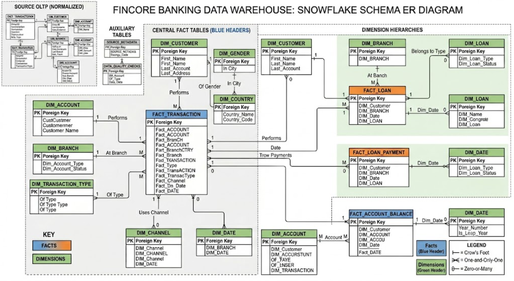

<p align="center">
  
</p>

---

# FinCore_Banking_API

---

# Industry Scenario

You are working as a Junior Software Developer in the IT Department of a banking company called FinCoreBank Pvt. Ltd.
The bank wants to modernize its old banking software system. Your development team follows Agile + Sprint methodology.

---

```
Your Team:
- Project Manager → Mr. Rajesh Sharma
- Database Administrator → Nishita
- Backend Developer → You
- Python Developer → Aayushi
- QA Tester → Pooja
```

---

```
The management wants a Banking System that can:
- Create customer accounts
- Deposit money
- Withdraw money
- Transfer funds
- Generate transaction history
- Maintain account security
- Generate reports
- Store all records using MySQL database
```
---

```

# FinCore Banking API – Project Modules

## SQ1: Banking Database Setup and Schema Exploration

Design and initialize the Banking Database using DDL (Data Definition Language) commands. Create database objects such as tables, constraints, indexes, and relationships while validating schema structure and data integrity requirements.

## SQ2: Secure Banking Data Model Implementation

Develop a secure banking data model by implementing Primary Keys, Foreign Keys, Unique Constraints, Check Constraints, Triggers, and Business Rules to ensure consistency, security, and compliance across banking operations.

## SQ3: Banking Data Initialization and Maintenance

Populate the database using INSERT statements and perform UPDATE and DELETE operations while maintaining referential integrity and enforcing business constraints.

## SQ4: Customer Transaction Investigation

Analyze customer transactions using SQL queries to track account activities, monitor transaction histories, identify spending patterns, and support audit requirements.

## SQ5: Customer Search and Retrieval System

Build an advanced customer search module with filtering, sorting, and dynamic query capabilities to efficiently retrieve customer and account information based on business requirements.

## SQ6: Banking Summary and Performance Reports

Generate analytical banking reports using aggregate functions such as SUM(), COUNT(), AVG(), MIN(), and MAX() to derive key business insights from transactional and customer data.

## SQ7: Loan Risk and Customer Ranking Analysis

Perform loan risk assessment and customer ranking using SQL Window Functions including RANK(), DENSE_RANK(), ROW_NUMBER(), and OVER() to identify high-risk customers and evaluate loan portfolios.

## SQ8: Transaction Reporting with SQL Joins

Develop comprehensive transaction reports using INNER JOIN, LEFT JOIN, RIGHT JOIN, and Multi-Table JOIN operations to integrate and analyze data across multiple banking entities.

## SQ9: Branch Performance and Comparative Analysis

Evaluate branch-level performance using correlated and non-correlated subqueries to compare operational metrics, customer growth, transaction volume, and revenue generation.

## SQ10: Business Intelligence Reporting Layer

Create a reporting layer using SQL Views to provide reusable, secure, and business-friendly datasets for management dashboards, business intelligence, and decision-making processes.

## Project Outcome

By completing all modules, learners will gain hands-on experience in database design, data modeling, SQL programming, transaction analysis, reporting, business intelligence, and banking domain data management using industry-standard practices.


```

---


---


---


